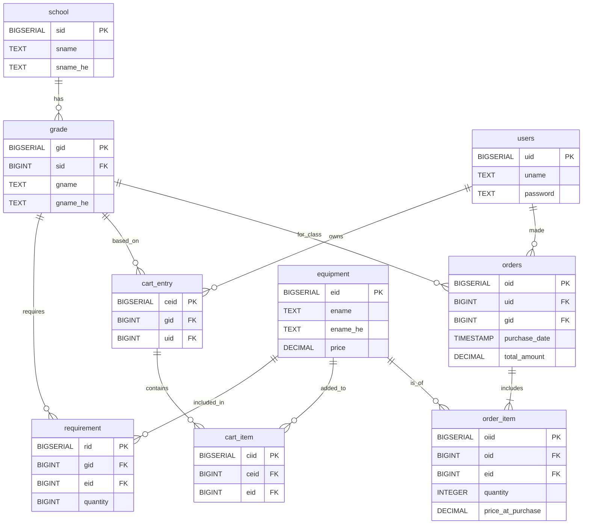

# Database Project - Motzklist

This repository contains the database schema, initialization scripts, and documentation for the Motzklist project.

## Overview
This project serves as the data layer for the Motzklist application. It includes the full schema definition, a dynamic Entity Relationship Diagram (ERD) for architectural clarity, and a collection of useful SQL queries. The system handles the hierarchy of schools and grades, equipment catalogs, user shopping carts, and a complete order history mechanism.

## Repository Structure
* **`init.sql`**: The primary script to initialize the database. It contains the `CREATE TABLE` statements, foreign key constraints, and initial mock data inserts.
* **`DB-queries.md`**: A documentation file containing structured SQL queries used for development, testing, and analytics.
* **`motzkin-setup.bat`**: A batch script for automated setup in a Windows environment (configured for PostgreSQL).
* **`LICENSE`**: This project is licensed under the Apache-2.0 License.

## Getting Started

### Prerequisites
To run these scripts, you will need PostgreSQL installed. The provided batch script is configured for PostgreSQL 17 by default.

### Setup Instructions
1. **Automated Setup (Windows):**
   Run the `motzkin-setup.bat` file to automate the database creation process. It will prompt you for your PostgreSQL password and offer options to build, reset, or drop the database.
   
2. **Manual Setup:**
   Open your preferred SQL management tool (such as DBeaver or pgAdmin) and execute the contents of `init.sql` within your target database.

## Database Schema (ERD)
The structure of the database is detailed below. GitHub natively supports Mermaid rendering, which automatically generates a visual diagram from this code block:

## Usage
For examples of how to interact with the data, please refer to the [DB-queries.md](./DB-queries.md) file. It includes scripts for:
* Managing schools, grades, and catalog equipment.
* Handling user shopping carts and the checkout process.
* Generating budget reports and class analytics.

## License

This project is licensed under the Creative Commons Attribution-NonCommercial 4.0 International License (CC BY-NC 4.0). See the [LICENSE](LICENSE) file for details.
